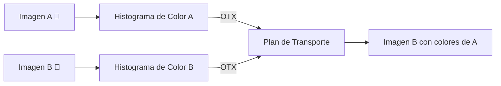
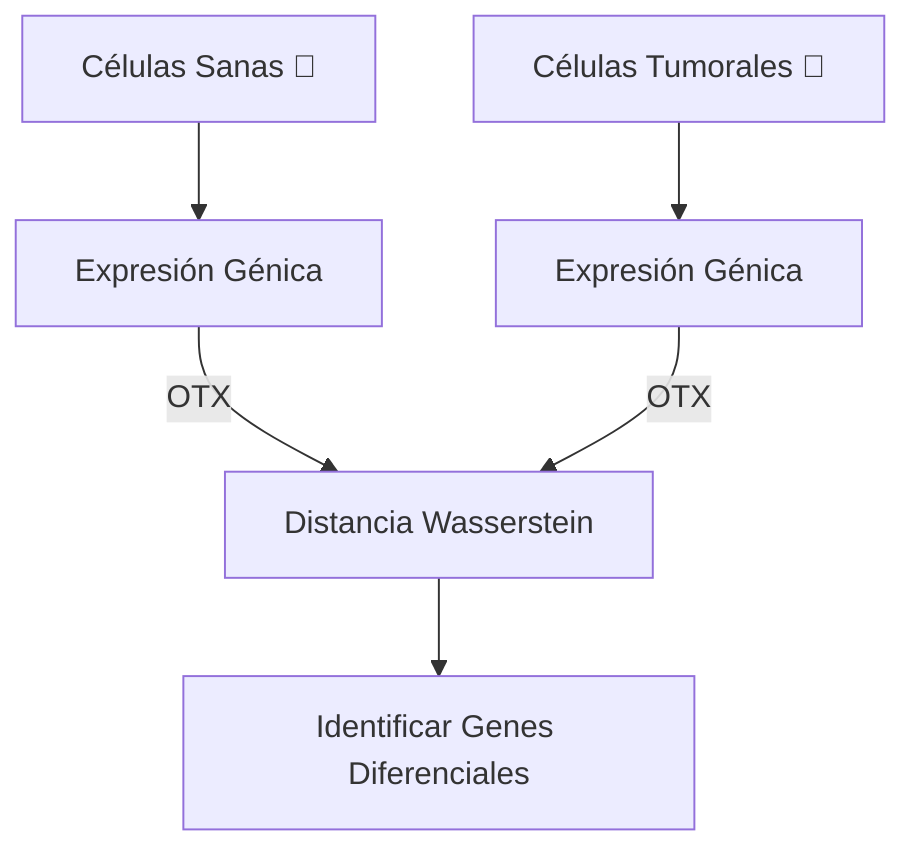

# 🌐 OTX: Casos de Uso del Optimal Transport

> **Más allá de la logística**: El Optimal Transport (Transporte Óptimo) es una de las teorías matemáticas más versátiles del siglo XXI, con aplicaciones que van desde la IA generativa hasta la física cuántica.

---

## 🧠 Inteligencia Artificial y Machine Learning

### 1. **Entrenamiento de GANs (Generative Adversarial Networks)**

La distancia Wasserstein (Earth Mover's Distance) resuelve el problema de **gradientes evanescentes** en GANs tradicionales.

| Problema | Solución con OTX |
|----------|------------------|
| JS/KL divergence no diferenciable cuando distribuciones no se solapan | Wasserstein siempre da gradientes útiles |
| Mode collapse | El transporte óptimo previene colapso |
| Entrenamiento inestable | Convergencia más suave |

**Aplicación**: Generación de imágenes, síntesis de audio, creación de datos sintéticos.

```javascript
// Comparar distribución generada vs. real
const realDist = extractFeatures(realImages);
const genDist = extractFeatures(generatedImages);
const loss = otxMax(realDist, genDist, costMatrix);
```

---

### 2. **Domain Adaptation y Transfer Learning**

Alinear distribuciones entre dominios fuente y objetivo para transferir conocimiento.


**Casos específicos**:
- Adaptar modelo entrenado en imágenes de día para funcionar de noche
- Transferir modelos de idioma inglés a español
- Adaptar sensores industriales entre fábricas diferentes

---

### 3. **Reinforcement Learning: Reward Shaping**

Usar OT para definir recompensas basadas en qué tan cerca está la distribución de estados actual de una distribución objetivo.

**Aplicación**: Robótica, vehículos autónomos, control de procesos industriales.

---

### 4. **Federated Learning**

Agregar modelos de múltiples clientes mediante promedio de Wasserstein en lugar de promedio simple.

| Método | Problema | Solución OTX |
|--------|----------|--------------|
| FedAvg tradicional | No respeta geometría de parámetros | Barycentric averaging |
| Datos no-IID | Divergencia entre clientes | Wasserstein barycenter |

---

## 🖼️ Computer Vision

### 5. **Color Transfer y Style Transfer**

Transferir la paleta de colores de una imagen a otra manteniendo la estructura.



**Uso real**: Corrección de color en cine, harmonización de sets de fotos.

---

### 6. **Point Cloud Matching (3D Vision)**

Comparar y alinear nubes de puntos 3D para:
- **LiDAR SLAM**: Mapeo y localización en vehículos autónomos
- **Registro 3D**: Alinear escaneos médicos (CT, MRI)
- **AR/VR**: Tracking de objetos en realidad aumentada

```javascript
// Alinear escaneo nuevo con mapa existente
const alignment = otxNano(currentScan, mapPoints, distanceMatrix);
```

---

### 7. **Shape Matching y Morfismo**

Transformar una forma en otra de manera óptima (mínimo esfuerzo).

**Aplicaciones**:
- Animación de personajes
- Análisis de deformaciones médicas
- Diseño paramétrico arquitectónico

---

## 💰 Finanzas y Economía

### 8. **Portfolio Optimization**

Minimizar el costo de transacciones al rebalancear un portfolio.

| De ↓ / A → | AAPL | GOOGL | MSFT |
|------------|------|-------|------|
| Efectivo   | 0.01 | 0.01  | 0.01 |
| AAPL       | 0    | 0.005 | 0.004|
| GOOGL      | 0.005| 0     | 0.003|

**El plan de transporte óptimo minimiza costos de comisiones y spread.**

---

### 9. **Risk Management**

Medir distancia entre distribuciones de pérdidas históricas y futuras proyectadas.

```javascript
// Stress testing
const historicalRisk = getHistoricalDistribution();
const stressedRisk = getStressedScenario();
const riskShift = otxBase(historicalRisk, stressedRisk, costMatrix);
```

---

### 10. **Market Making y Liquidez**

Matching óptimo entre órdenes de compra y venta en un order book.

---

## 🏥 Medicina y Biología

### 11. **Single-Cell RNA Analysis**

Comparar poblaciones de células entre condiciones (sano vs. enfermo).



---

### 12. **Drug Discovery**

Comparar distribuciones moleculares para:
- Predecir efectos de fármacos
- Identificar candidatos similares
- Análisis de toxicidad

---

### 13. **Medical Imaging Registration**

Alinear imágenes médicas de diferentes momentos o modalidades.

**Casos**:
- Pre-operatorio vs. intra-operatorio
- CT vs. MRI fusion
- Seguimiento de tumores en el tiempo

---

## 🚚 Logística y Operaciones

### 14. **Vehicle Routing Problem (VRP)**

Asignar paquetes a vehículos de manera óptima.

```javascript
const sources = warehouses.map(w => w.inventory);
const targets = customers.map(c => c.demand);
const plan = otxMax(sources, targets, distanceMatrix);
```

---

### 15. **Supply Chain Optimization**

Flujo óptimo de materiales a través de la cadena de suministro.


---

### 16. **Last-Mile Delivery**

Asignación de repartidores a zonas de entrega minimizando distancia total.

---

## 🎮 Gráficos y Renderizado

### 17. **Particle Systems**

Transicionar sistemas de partículas de manera fluida (explosiones, fluidos).

```javascript
// Morphing de efectos de partículas
const explosionState = otxNano(particles_t0, particles_t1, costs);
```

---

### 18. **Texture Synthesis**

Generar texturas procedurales que se asemejen a ejemplos dados.

---

### 19. **Neural Rendering**

Entrenar NeRFs y modelos de síntesis de vistas con pérdidas basadas en OT.

---

## 🔬 Física y Ciencia

### 20. **Quantum Computing**

Comparar estados cuánticos y diseñar circuitos óptimos de transición.

---

### 21. **Cosmología**

Reconstruir el campo de velocidades del universo a partir de distribuciones de galaxias.

---

### 22. **Fluid Dynamics**

Interpolación de fluidos (Benamou-Brenier) para simulación y predicción meteorológica.

---

## 🎵 Audio y Música

### 23. **Audio Style Transfer**

Transferir timbres entre instrumentos o voces.

---

### 24. **Music Information Retrieval**

Comparar similitud entre canciones basándose en distribuciones espectrales.

```javascript
const spectrumA = analyzeSpectrum(songA);
const spectrumB = analyzeSpectrum(songB);
const similarity = 1 / (1 + otxNano(spectrumA, spectrumB, freqCosts).dist);
```

---

## 📊 NLP y Procesamiento de Texto

### 25. **Word Mover's Distance**

Medir similitud semántica entre documentos usando embeddings de palabras.


**Aplicaciones**:
- Detección de plagio
- Clustering de documentos
- Búsqueda semántica

---

### 26. **Cross-Lingual Alignment**

Alinear embeddings de diferentes idiomas para traducción zero-shot.

---

## 🌍 Geoespacial y Urbanismo

### 27. **Urban Planning**

Optimizar ubicación de servicios públicos (hospitales, escuelas) minimizando distancia promedio de la población.

---

### 28. **Traffic Flow Optimization**

Redistribuir vehículos en redes de transporte para minimizar congestión.

---

### 29. **Disaster Response**

Asignación óptima de recursos de emergencia a zonas afectadas.

---

## ⚡ Qué Solver Usar

| Caso de Uso | Solver Recomendado | Razón |
|-------------|-------------------|-------|
| Real-time (< 1ms) | **OTX-Nano** | O(N log N), sub-millisegundo |
| Gaming/Particles | **OTX-Nano** | 60 FPS requerido |
| Training ML | **OTX-Base** | Alta precisión para gradientes |
| Batch Processing | **OTX-Base** | Mejor accuracy offline |
| Massive Scale (N > 1000) | **OTX-Max** | O(N), escala lineal |
| Production APIs | **OTX-Max** | Balance velocidad/precisión |

---

## 📚 Referencias

1. Peyré, G., & Cuturi, M. (2019). *Computational Optimal Transport*
2. Arjovsky, M., et al. (2017). *Wasserstein GAN* - ICML
3. Rubner, Y., et al. (2000). *Earth Mover's Distance* - IJCV
4. Cuturi, M. (2013). *Sinkhorn Distances* - NeurIPS

---

> **OTX** hace que todas estas aplicaciones sean **prácticas en tiempo real**, transformando una teoría matemática elegante en una herramienta de producción.
