# OTX - Optimal Transport eXtreme

> Ultra-fast Wasserstein distance solvers for real-time ML and logistics

[](https://www.npmjs.com/package/otx)
[](https://opensource.org/licenses/Apache-2.0)

## 🚀 Features

- **OTX-Nano** — Sliced Wasserstein, O(N log N), sub-1ms latency
- **OTX-Base** — Sparse Sinkhorn, O(N²), high precision  
- **OTX-Max** — Hyper-sparse projections, O(N), sub-50ms at N=3000

## 🧠 How it Works

OTX implements a multi-stage approach to solving the Optimal Transport problem, balancing speed and precision:

```mermaid
graph TD
    A["Input Distributions"] --> B{"Select Solver"}
    B -->|"Speed Focus"| C["OTX-Nano"]
    B -->|"Balanced"| D["OTX-Base"]
    B -->|"Extreme Scale"| E["OTX-Max"]
    
    C -->|"1D Projections"| F["Sliced Wasserstein"]
    F --> G["O(N log N)"]
    
    D -->|"Entropic Reg."| H["Sparse Sinkhorn"]
    H --> I["O(N²)"]
    
    E -->|"Hyper-Sparse"| J["Projection Iterations"]
    J --> K["O(N)"]
    
    G --> L["Result"]
    I --> L
    K --> L
```



### 1. OTX-Nano (The Scout)
Uses **Sliced Wasserstein** primitives. It projects high-dimensional distributions onto random 1D lines where sorting solves the transport problem instantly.
- **Best for:** Real-time rendering, massive particle systems, initial rough routing.

### 2. OTX-Base (The Anchor)
A refined **Sparse Sinkhorn** implementation. It uses kernel pruning to ignore zero-probability paths, focusing computation only where it matters.
- **Best for:** Standard logistics, high-precision matching, financial modeling.

### 3. OTX-Max (The Speedster)
Our flagship **Hyper-Sparse** solver. It combines the projection speed of Nano to initialize a highly sparse Newton iteration.
- **Accuracy:** >99.8% relative to dense solvers.
- **Speed:** Orders of magnitude faster at N > 1000.

## 📦 Installation

```bash
# npm
npm install otx

# bun
bun add otx
```

## ⚡ Quick Start

```javascript
import { otxMax } from 'otx'
import { otxNano } from 'otx/nano'
import { otxBase } from 'otx/base'

// Your source and target distributions
const source = [0.25, 0.25, 0.25, 0.25]
const target = [0.1, 0.2, 0.3, 0.4]

// Compute optimal transport
const result = otxMax(source, target, costMatrix)
console.log(result.distance, result.plan)
```

## 📊 Benchmarks

| N | Dense | Nano | Base | Max |
|---|-------|------|------|-----|
| 50 | 100ms | 0.4ms | 21ms | 5.7ms |
| 200 | 758ms | 0.9ms | 13ms | 4.0ms |
| 500 | 6,122ms | 0.3ms | 67ms | 4.2ms |
| 1000 | 38,498ms | 4.1ms | 143ms | 6.7ms |
| 3000 | 1.4M ms | 1.9ms | 1,609ms | **40ms** |

## 🔬 Research

See our paper: **OTX-MAX: Accelerating Optimal Transport with Hyper-Sparse Projection Iterations**

Based on techniques from:
- Sinkhorn-Newton-Sparse (SNS) - ICLR 2024
- Sliced Wasserstein Distance
- Entropic regularization

## 💎 Licensing & Pricing

OTX is dual-licensed to support sustainable open-source development.

- **Open Source (AGPLv3)**: Free for open-source projects. If you use OTX, your project must also be open-source.
- **Commercial License**: For proprietary/closed-source applications.

| Feature | Open Source (AGPL) | Commercial License |
| :--- | :---: | :---: |
| **Cost** | Free | **$2,500/yr** |
| **Use in Closed Source** | ❌ | ✅ |
| **Legal Indemnity** | ❌ | ✅ |
| **SLA Support** | Community | Priority |

[**Get a Commercial License**](mailto:sergiolazaromondarg@gmail.com)

## 📄 License

AGPL-3.0 © Sergio Lazaro Mondargo
